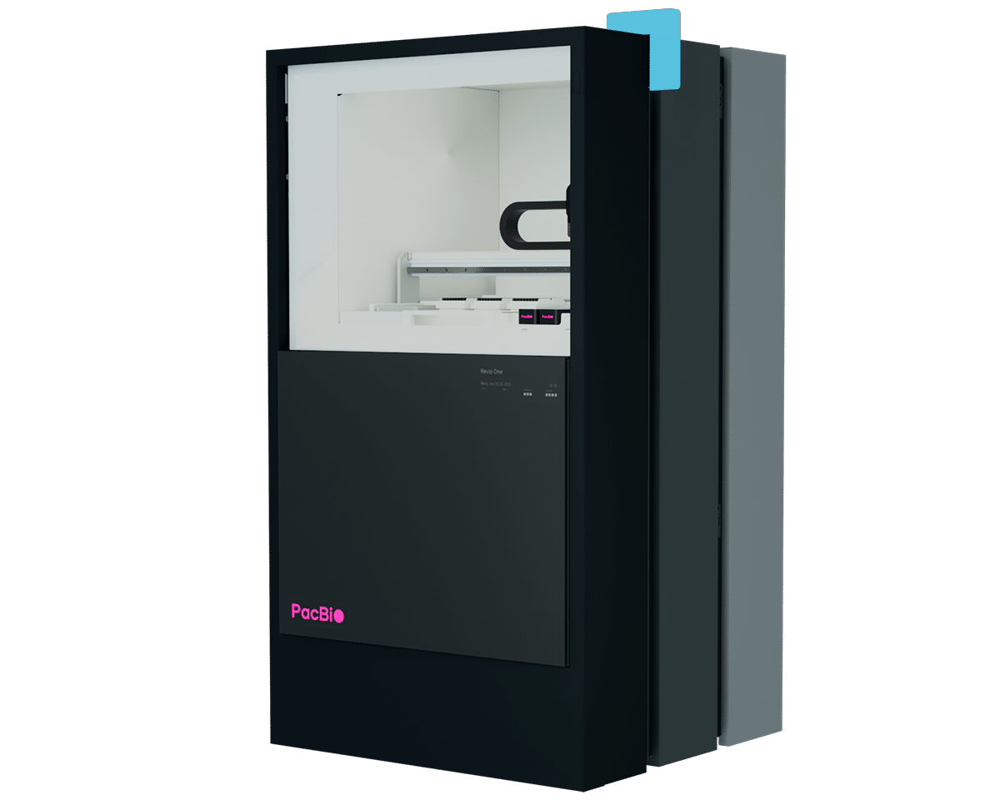
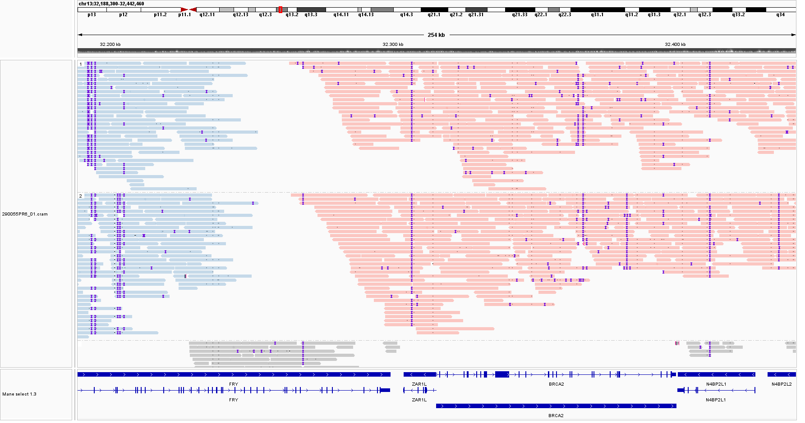
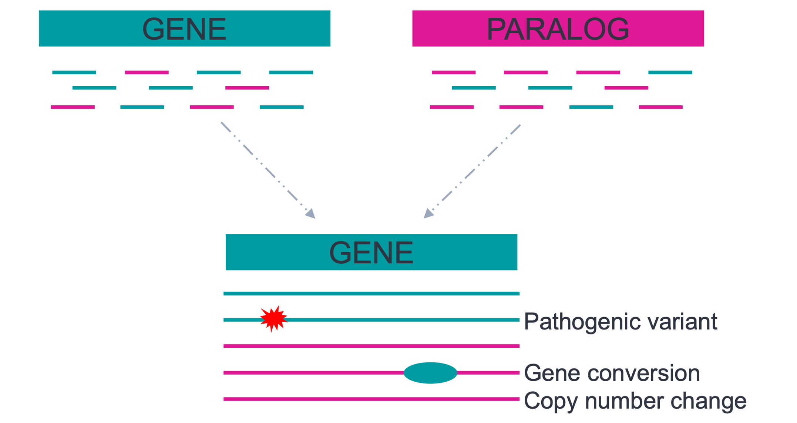

## Quick-Facts

:::: {.columns}

::: {.column width="60%"}

- Read-Länge: 
  - 15-20 kbp PacBio
  - 10–30 kbp ONT (Variabel, auch bis zu 4 Mbp [@MahmoudEtAlHitchhikersGuideLongread2025])
- Basecalling-Genauigkeit: 
  - PacBio: >99,9 % - >99,99 % (Q30–Q40)
  - ONT: >99,0 % - ~99,5 % (Q20–Q23) simplex, >99,9 % (Q30) duplex 
- Methylierung (ONT leicht besser als PacBio [@FuEtAlComputationalAnalysisDNA2025])
- **Phasing**

:::
::: {.column width="40%"}

{width=60% #fig-promethion}

{width=80% #fig-revio}

:::
::::

:::: {.notes}
- beide Technologien lesen Einzel-Moleküle direkt
- ONT: Längen variabel, größere Verteilung, oft als N50 angegeben (also 50% der Reads sind länger als N50), sehr lange Reads möglich, aber auch viele kurze Reads, sehr Wetlab anbhängig
- PacBio: Längen stabil, kleine werden vorher ausgefiltert im Wetlab (für Circular Consensus Sequencing)
::::

## Benchmarks

```{python}
#| echo: false
#| label: fig-benchmarks
#| fig-cap: "Benchmarks. Illumina/ONT Daten von megSAP [@MegSAPDocPerformancemd], PacBio eigene Daten. Indel <= 50 bp."
import pandas as pd
import plotly.express as px

df = pd.read_csv("benchmark_data.csv")
df["Platform"] = df["Sequencing Type"].str.extract(r"^(Illumina|ONT|PacBio)")

metrics = df.melt(
    id_vars=["Platform", "Sequencing Type"],
    value_vars=["SNV_Sensitivity", "SNV_Precision", "Indel_Sensitivity", "Indel_Precision"],
    var_name="Metric",
    value_name="Percent"
)
metrics["Metric"] = metrics["Metric"].replace({
    "SNV_Sensitivity": "SNV Sensitivität",
    "SNV_Precision": "SNV Präzision",
    "Indel_Sensitivity": "Indel Sensitivität",
    "Indel_Precision": "Indel Präzision"
})

color_map = {
    "Illumina Short-Read - DRAGEN 4.3.13 with ML model 35x": "#b0b0b0",
    "ONT Long-Read (high accuracy) 42x": "rgb(85, 178, 207)",
    "ONT Long-Read (super accuracy) 42x": "rgb(65, 158, 187)",
    "PacBio Long-Read 20x": "rgb(217, 23, 141)",
    "PacBio Long-Read 30x": "rgb(187, 13, 121)"
}

fig = px.bar(
    metrics,
    y="Metric",
    x="Percent",
    color="Sequencing Type",
    color_discrete_map=color_map,
    orientation="h",
    barmode="group",
    template="plotly_white",
    text_auto=".2f",
    category_orders={"Sequencing Type": list(color_map.keys())}
)
fig.update_layout(xaxis_range=[70, 100], height=900, xaxis_title="Prozent (%)", yaxis_title=None, legend=dict(orientation="h", yanchor="top", y=-0.3, xanchor="center", x=0.5, title=""), yaxis=dict(autorange="reversed"), font=dict(family="Atkinson Hyperlegible Next, sans-serif", size=24, color="black"), title_font=dict(family="Jost, sans-serif"))
fig.show()
```

:::: {.notes}
- Sensitivität: Von allen echten Varianten im Truth-Set — wie viele hat der Caller gefunden?
- Präzision: Von allen Varianten, die der Caller gerufen hat — wie viele sind echt (keine False Positives)?
::::

## Phasing

{#fig-igv .r-stretch}

## Paraphase[@ChenEtAlGenomewideProfilingHighly2025;@ChenEtAlComprehensiveSMN1SMN22023]

:::: {.columns}

::: {.column width="60%"}

- Long-Read-basierter Caller für hochhomologe Paraloge/Pseudogene (z.B. *SMN1/SMN2*, *PMS2*, *CYP21A2*, *GBA*)
- Realignment aller Reads einer Genfamilie auf ein Referenzgen, anschließend Phasing in Haplotypen
- Liefert Kopienzahlen, gephaste Varianten und Genkonversionen

:::

::: {.column width="40%"}

{width=100% #fig-paraphase}

:::

::::

:::: {.notes}
- Neuere Veriosnen exklusiv für PacBio Daten lizensiert
- megSAP integriert
- Soon eine DB dazu (CN)
::::

## Paper Empfehlung

::: {.r-fit-text .center .center-y}
Zheng, X., Sanio, P., Luo, R., Li, H. & Sedlazeck, F. J.

**Bioinformatics for human long-read whole-genome sequencing**

Nature Reviews Methods Primers 6, 70 (2026) [@ZhengEtAlBioinformaticsHumanLongread2026]

:::

## References {.smaller}

::: {#refs}
:::